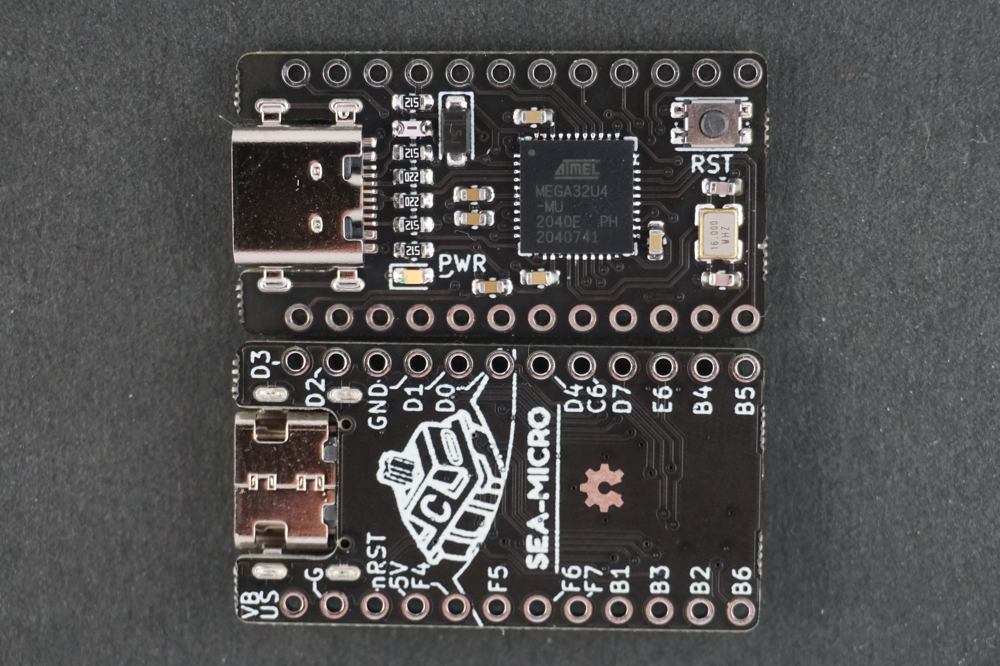

# sea-micro

An Arduino Pro Micro, with but with a Type-C connector.

Targeted as an alternative for the ubiquitous Pro Micro in DIY keyboard applications.

Features:
- Pro Micro compatible pinout.
- Mid Mount USB Type-C Connector.
- On-board reset button.

Developed in conjunction with [Custom KBD](customkbd.com).

Revision History:

0.1 - "Elite-C" compatible pinout, with added ESD protection.

0.2 - Removes castellated pads for lower cost manufacturing.

0.3 - Name changed to sea-micro, now targeting Pro Micro w/ Type-C feature set at the lowest cost possible.
